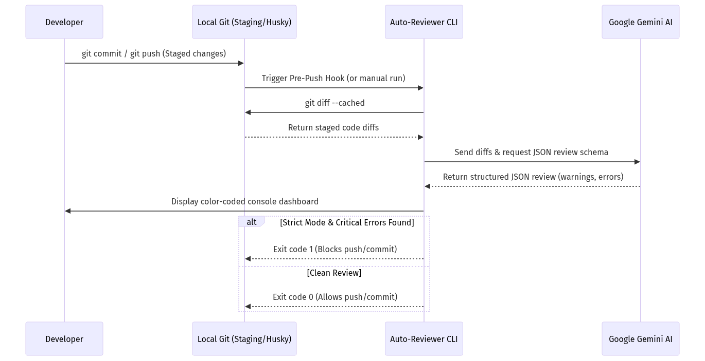

# AI-Powered Git Workflow Assistant (Auto-Reviewer & Tester)

An intelligent, TypeScript-powered command-line interface (CLI) and Git hook assistant. It hooks directly into local Git workflows, utilizes Google's Gemini LLM to automatically review staged code diffs using strict JSON schema validation, and compiles unit test boilerplates instantly.

---

## Features

- **Automated Code Reviews**: Scans staged diffs, analyzes logic, complexity, clean code practices, and security risks. Prints a color-coded console dashboard group-by-file with actionable suggestions.
- **Strict Gated Commits/Pushes**: Pass the `--strict` flag to automatically exit with a non-zero code if the AI identifies critical (`error` level) problems, making it a perfect gatekeeper for Git hooks.
- **Automated Unit Test Generation**: Generates ready-to-use, comprehensive TypeScript unit test boilerplates for your source files using Jest.
- **Robust Schema Binding**: Enforces structured JSON output directly from the Gemini API, ensuring 100% parseable reviews without messy regular expressions.

---

## Screenshots & Workflow



---

## Getting Started

### 1. Prerequisites

Ensure you have **Node.js** and **npm** installed on your system:
```bash
node -v  # Recommended: Node 18+ or 20+
npm -v
```

### 2. Installation

Clone this repository and install all dependencies:
```bash
git clone <repository-url>
cd <repository-directory>
npm install
```

### 3. Build the CLI

Compile the TypeScript source files to JavaScript:
```bash
npm run build
```

---

## Configuration

The tool requires a Google Gemini API Key. 

1. Create a `.env` file in the root of your project:
   ```env
   GEMINI_API_KEY=your_gemini_api_key_here
   GEMINI_MODEL=gemini-1.5-flash  # Optional. Defaults to gemini-1.5-flash
   ```

To get a Gemini API Key, visit the [Google AI Studio Console](https://aistudio.google.com/).

---

## CLI Usage

### Command 1: Code Review (`review`)

Runs an automated review of your currently staged files (`git diff --cached`).

```bash
# Run the review on currently staged changes
npm run dev -- review

# Or execute using the compiled JS output
node dist/src/index.js review

# Enable strict mode to exit with code 1 if critical bugs are identified
npm run dev -- review --strict
```

### Command 2: Unit Test Generator (`generate-tests`)

Generates a Jest test suite for a specified staged file. If the file is not staged, it reads its content from the local working directory.

```bash
# Generate tests for a file (writes to src/services/gitService.test.ts by default)
npm run dev -- generate-tests src/services/gitService.ts

# Specify a custom output path for the test file
npm run dev -- generate-tests src/services/gitService.ts --output tests/customGitService.test.ts
```

---

## Git Hooks Integration with Husky

You can automate this assistant using Git hooks via **Husky** so that every push (or commit) is reviewed by AI.

### Setup Husky

1. Install Husky and configure hooks:
   ```bash
   npx husky-init && npm install
   ```

2. Add a `pre-push` hook (to run auto-reviews before pushing code to remote):
   Create/edit the `.husky/pre-push` file:
   ```bash
   #!/bin/sh
   . "$(dirname "$0")/_/husky.sh"

   echo "🤖 Running AI Code Review on staged changes..."
   # Run in strict mode to block pushes if critical bugs are identified
   npm run dev -- review --strict
   ```

3. Ensure the hook file is executable:
   ```bash
   chmod +x .husky/pre-push
   ```

---

## Development & Test Suite

This codebase is built in TypeScript with strict type checking, formatted using Prettier, and checked using ESLint.

### Run Unit Tests
Unit tests use Jest and Jest mocks to run fast and fully offline without hitting the real Gemini API.
```bash
npm run test
```

### Linting & Formatting
```bash
# Verify lint rules
npm run lint

# Auto-format codebase
npm run format
```

---

## License

This project is licensed under the MIT License.
